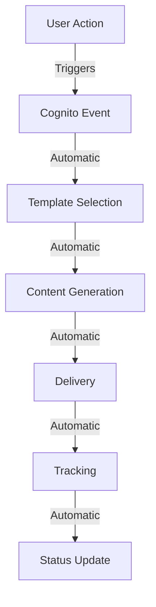
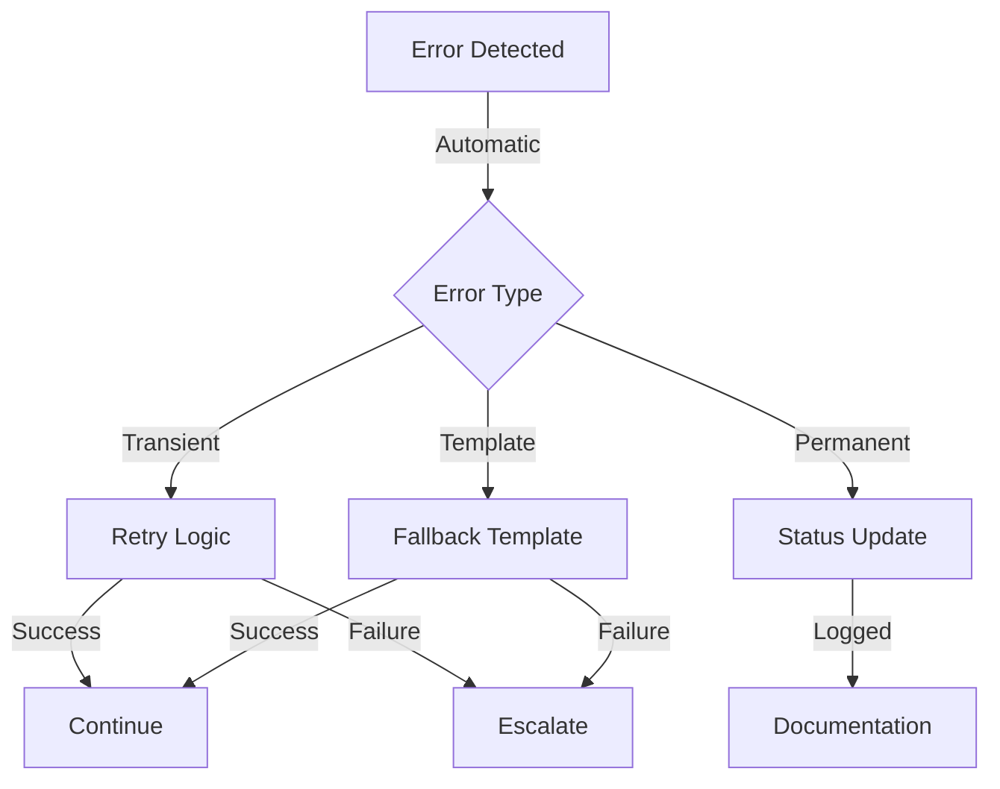

# Automation Strategy

## Overview

This document outlines our zero-touch automation strategy for the email system, detailing how we minimize manual intervention through automated processes.

## Automated Workflows

### 1. Email Lifecycle

### 2. Error Handling

## Automation Levels

### Level 1: Basic Automation

- Email template selection
- Content personalization
- Delivery tracking
- Basic error handling

### Level 2: Enhanced Automation

- Retry mechanisms
- Template fallbacks
- Performance optimization
- Resource scaling

### Level 3: Intelligent Automation

- Pattern recognition
- Predictive analytics
- Self-healing
- Automated optimization

## Zero-Touch Areas

### 1. Email Processing

- **Template Management**

  - Automatic selection
  - Dynamic content
  - Fallback options

- **Delivery Optimization**
  - Queue management
  - Rate limiting
  - Priority handling

### 2. Error Management

- **Detection**

  - Real-time monitoring
  - Pattern recognition
  - Threshold checking

- **Resolution**
  - Automatic retries
  - Fallback procedures
  - Status updates

### 3. Performance Optimization

- **Resource Management**

  - Auto-scaling
  - Load balancing
  - Capacity planning

- **Queue Optimization**
  - Priority scheduling
  - Rate adjustment
  - Throughput optimization

## Manual Intervention Points

### Required Manual Actions

1. **Template Updates**

   - New template creation
   - Major content changes
   - Design modifications

2. **Security Management**

   - Policy updates
   - Access control changes
   - Compliance updates

3. **Critical Issues**
   - Security incidents
   - Compliance violations
   - System-wide failures

### Automation Roadmap

#### Phase 1: Current State

- Basic automation
- Error handling
- Performance monitoring

#### Phase 2: Enhanced Automation

- Advanced retry logic
- Improved monitoring
- Pattern detection

#### Phase 3: Intelligent Automation

- ML-based optimization
- Predictive maintenance
- Automated recovery

## Best Practices

### Implementation

1. Start with essential automation
2. Add complexity gradually
3. Monitor effectiveness
4. Adjust based on data

### Maintenance

1. Regular performance review
2. Pattern analysis
3. Optimization updates
4. Documentation updates

### Monitoring

1. Set appropriate thresholds
2. Monitor automation effectiveness
3. Track manual interventions
4. Analyze patterns

## Metrics & KPIs

### Automation Effectiveness

- Percentage of automated handling
- Manual intervention frequency
- Resolution time
- Error recovery rate

### System Performance

- Delivery success rate
- Processing time
- Resource utilization
- Error frequency

### Cost Efficiency

- Resource optimization
- Processing efficiency
- Manual effort reduction
- Operational savings

## Future Enhancements

### Short-term

1. Enhanced monitoring
2. Improved retry logic
3. Better fallback handling
4. Automated reporting

### Medium-term

1. Pattern recognition
2. Predictive analytics
3. Advanced optimization
4. Self-healing capabilities

### Long-term

1. AI/ML integration
2. Automated optimization
3. Predictive maintenance
4. Zero-touch operations

## Conclusion

Our automation strategy aims to minimize manual intervention while maintaining system reliability and performance. Through continuous improvement and intelligent automation, we work towards a fully automated, self-managing system.
