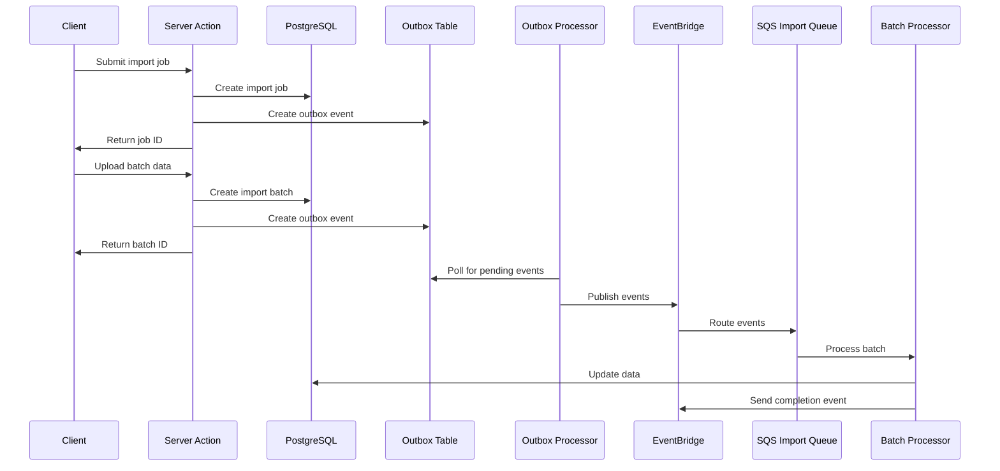

# Bellyfed Bulk Data Import System

This document provides an overview of the Bellyfed bulk data import system, which integrates Next.js Server Actions with AWS event-driven architecture using the outbox pattern.

## Architecture Overview

The bulk data import system follows a hybrid approach:

1. **Next.js Server Actions** handle the user interface and initial data processing
2. **Outbox Pattern** ensures reliable event delivery from Server Actions to AWS
3. **AWS Event-Driven Architecture** processes the data in batches asynchronously

## Components

### 1. Database Schema

The system uses the following tables in PostgreSQL:

- `import_jobs`: Tracks import jobs and their status
- `import_batches`: Tracks individual batches within a job
- `imported_restaurants`: Tracks imported restaurant data
- `imported_dishes`: Tracks imported dish data
- `outbox_events`: Stores events for reliable delivery

### 2. Server Actions

Server Actions in `/packages/frontend/app/actions/imports.ts` provide the following functionality:

- `createImportJob`: Creates a new import job
- `createImportBatch`: Creates a new batch within a job
- `processImportData`: Processes data for a specific batch
- `getImportJobStatus`: Gets the status of an import job

### 3. Outbox Pattern

The outbox pattern implementation in `/packages/frontend/lib/outbox/index.ts` provides:

- `createOutboxEvent`: Creates an event in the outbox table
- `createOutboxEventInTransaction`: Creates an event within a transaction
- `getPendingOutboxEvents`: Retrieves pending events
- `markOutboxEventAsProcessed`: Marks an event as processed
- `cleanupProcessedOutboxEvents`: Cleans up old processed events

### 4. AWS Lambda Functions

The system uses the following Lambda functions:

- `outbox-processor`: Polls the outbox table and publishes events to EventBridge
- `batch-processor`: Processes import batches with proper chunking and error handling

### 5. Infrastructure

The infrastructure is defined in `/packages/infra/lib/import-stack.ts` and includes:

- EventBridge rules and targets
- Lambda function definitions
- SQS queues for reliable message delivery
- IAM permissions for all components

## Workflow

### 1. Creating an Import Job

1. User initiates an import job through the UI
2. Server Action creates a job record in the database
3. Server Action creates an outbox event
4. Job ID is returned to the client

### 2. Uploading Batch Data

1. User uploads batch data through the UI
2. Server Action creates a batch record in the database
3. Server Action creates an outbox event
4. Batch ID is returned to the client

### 3. Processing Data

1. Outbox processor polls the outbox table for pending events
2. Events are published to EventBridge
3. EventBridge routes events to the appropriate SQS queue
4. Batch processor consumes events from the queue
5. Batch processor processes the data and updates the database
6. Batch processor sends completion events to EventBridge

## Error Handling

The system includes comprehensive error handling:

1. **Transaction Boundaries**: Database operations and outbox event creation are wrapped in transactions
2. **Retry Mechanisms**: SQS provides automatic retries for failed processing
3. **Dead Letter Queues**: Messages that fail processing are sent to a DLQ
4. **Error Tracking**: Detailed error information is stored in the database

## Monitoring

The system can be monitored through:

1. **CloudWatch Metrics**: Lambda invocations, SQS queue metrics, etc.
2. **CloudWatch Logs**: Detailed logs from Lambda functions
3. **Database Queries**: Status of import jobs and batches

## Configuration

The system can be configured through environment variables:

- `DATABASE_URL`: PostgreSQL connection string
- `EVENT_BUS_NAME`: Name of the EventBridge event bus
- `BATCH_SIZE`: Number of items to process in a batch

## Deployment

To deploy the system:

1. Deploy the Prisma schema changes
2. Deploy the Server Actions and outbox pattern implementation
3. Deploy the AWS infrastructure using CDK

## Security Considerations

The system implements the following security measures:

1. **Authentication**: Server Actions require authentication
2. **Authorization**: Users can only access their own import jobs
3. **Input Validation**: All inputs are validated using Zod schemas
4. **Least Privilege**: IAM roles follow the principle of least privilege

## Performance Considerations

For optimal performance:

1. **Batch Size**: Keep batch sizes reasonable (100-1000 items)
2. **Concurrency**: Multiple batches can be processed concurrently
3. **Database Indexes**: Ensure proper indexes on frequently queried fields
4. **Monitoring**: Monitor system performance and adjust resources as needed

## Troubleshooting

Common issues and solutions:

1. **Failed Jobs**: Check the `error_details` field in the `import_jobs` table
2. **Stuck Batches**: Check the SQS queue and DLQ for stuck messages
3. **Performance Issues**: Monitor Lambda duration and adjust memory/timeout settings
