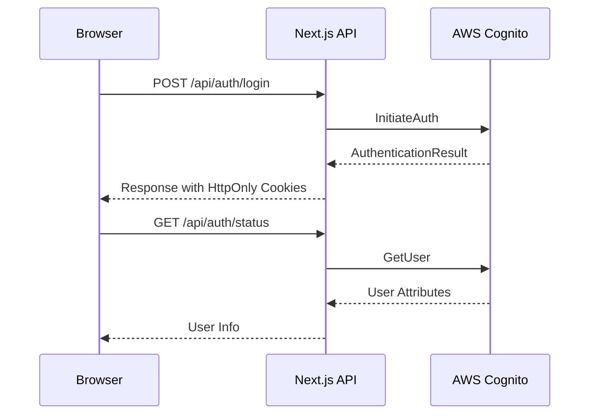
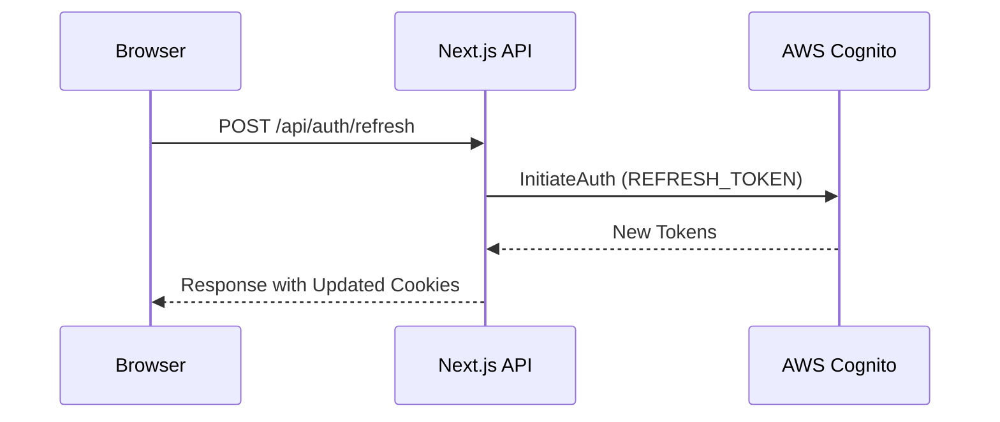
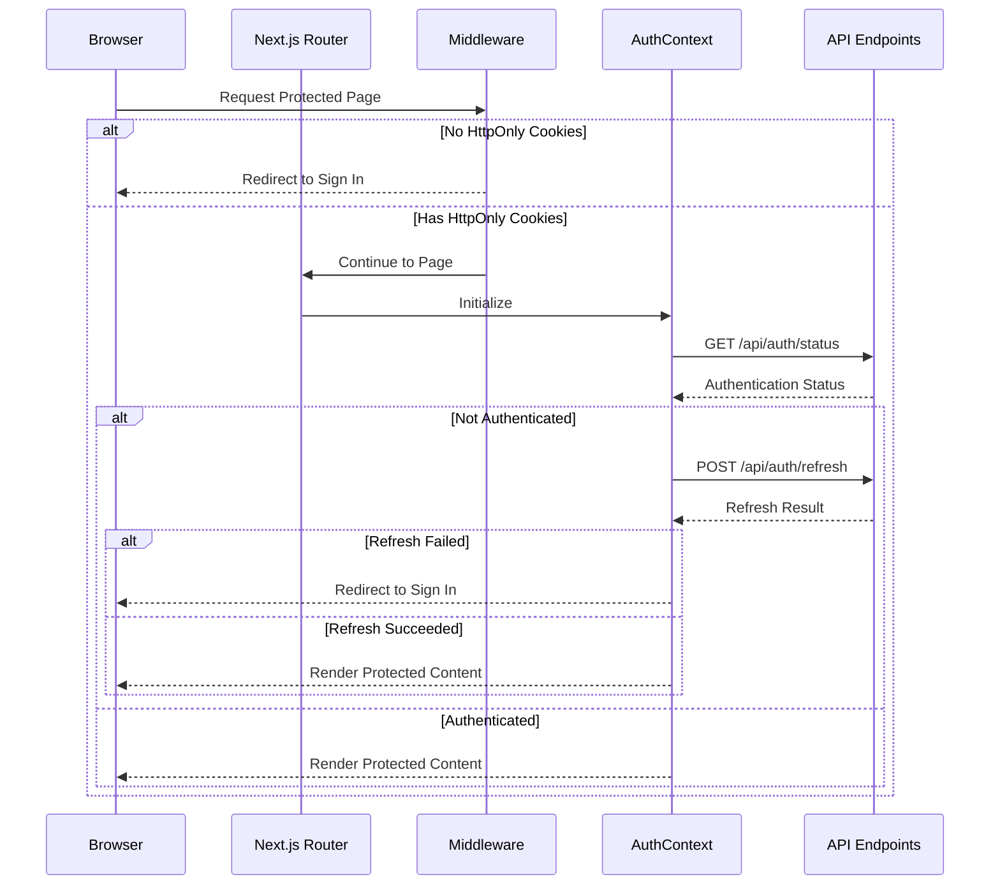
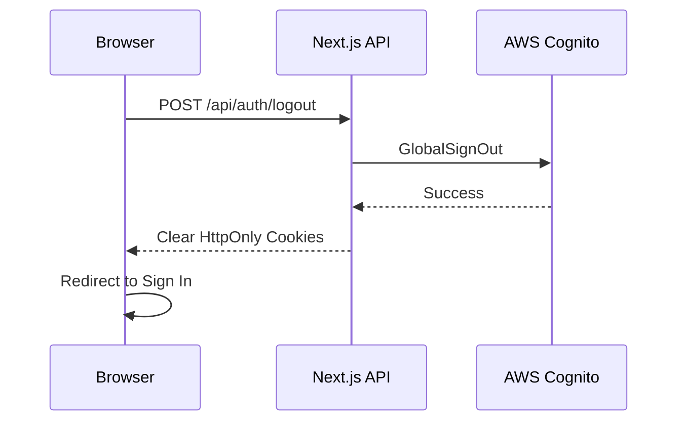
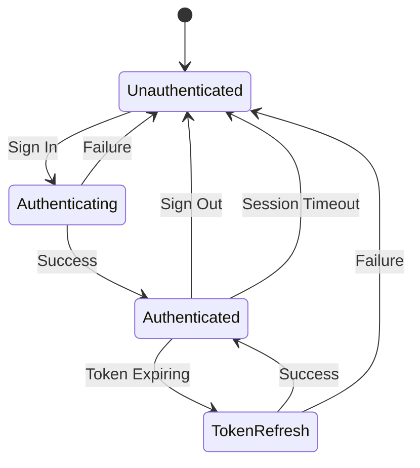

# Authentication Flow Diagrams

This document provides visual representations of the authentication flows in the BellyFed application.

## Sign In Flow



## Token Refresh Flow



## Protected Route Flow



## Sign Out Flow



## Component Interaction

```mermaid
graph TD
    A[Browser] --> B[Middleware]
    B -->|Protected Route| C[ProtectedRoute Component]
    B -->|Public Route| D[Page Component]

    C --> E[AuthContext]
    D --> E

    E -->|Status Check| F[/api/auth/status]
    E -->|Sign In| G[/api/auth/login]
    E -->|Sign Out| H[/api/auth/logout]
    E -->|Refresh| I[/api/auth/refresh]

    F --> J[AWS Cognito]
    G --> J
    H --> J
    I --> J
```

## Authentication State Management



These diagrams can be rendered using Mermaid-compatible tools or viewers.
