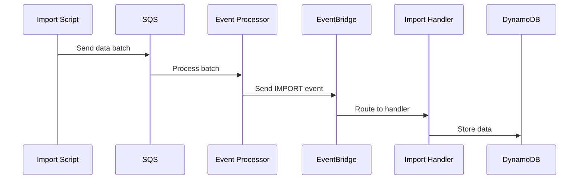
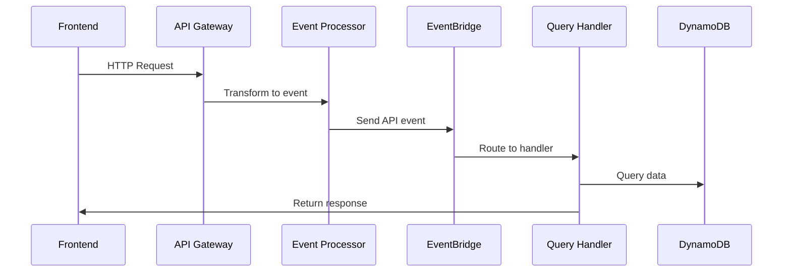

# Event Flow Patterns

Version: v1.0.0
Last Updated: 2024-12-07 18:59:59 +08:00
Status: Active

## Overview

Common event flow patterns used in the BellyFed platform. These patterns ensure consistent and reliable event processing across the system.

## Core Patterns

### 1. Import Processing Pattern



### 2. API Request Pattern



## Event Schema Standards

### Base Event Schema

```typescript
interface BaseEvent {
  event_id: string;
  timestamp: string;
  event_type: string;
  source: string;
  version: string;
  trace_id: string;
  status: string;
  payload: any;
}
```

### Common Event Types

1. Import Events

   - RESTAURANT_IMPORT
   - MENU_IMPORT
   - REVIEW_IMPORT

2. API Events
   - GET_RESTAURANTS
   - GET_RESTAURANT
   - GET_MENU
   - GET_REVIEWS

## Error Handling

### Retry Pattern

1. Initial attempt through main queue
2. Failed events to DLQ
3. Periodic DLQ processing
4. Maximum retry attempts

### Error Events

```typescript
interface ErrorEvent extends BaseEvent {
  error: {
    code: string;
    message: string;
    stack?: string;
  };
}
```

## Version History

### [v1.0.0] - 2024-12-07 18:59:59 +08:00

- Initial pattern documentation
- Defined core flow patterns
- Established event schemas
- Documented error handling
