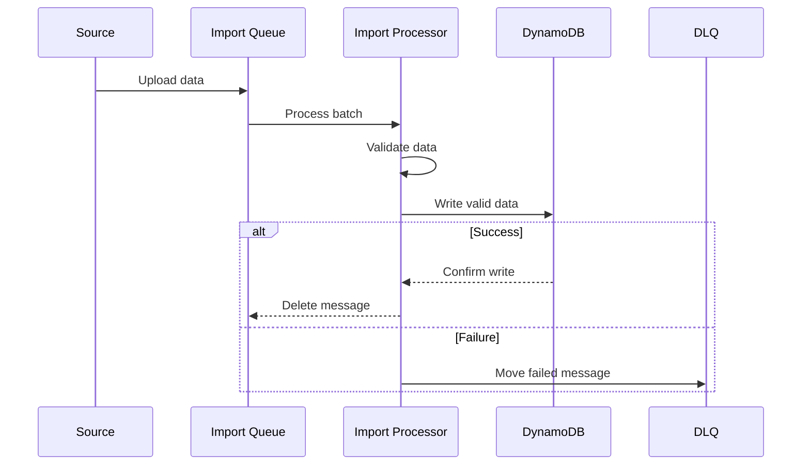
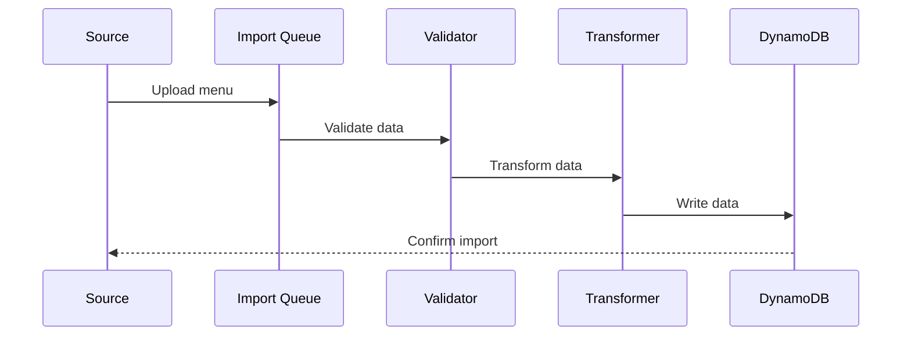

# Data Import Workflows

Version: v1.0.0
Last Updated: 2024-12-09 11:16:36 +08:00
Status: Active

## Overview

Standard operating procedures for data import operations in the Oishiiteru platform.

## Import Workflows

### 1. Restaurant Data Import

### 2. Menu Data Import

## Validation Workflows

### 1. Data Validation Process

1. Schema validation
2. Business rule validation
3. Data type checking
4. Relationship validation
5. Constraint checking

### 2. Error Handling Process

1. Capture error details
2. Log validation failures
3. Move to DLQ if needed
4. Notify monitoring system
5. Update import status

## Monitoring Workflows

### 1. Import Monitoring

1. Track progress metrics
2. Monitor error rates
3. Check throughput
4. Validate results
5. Generate reports

### 2. Performance Tracking

1. Measure import speed
2. Track resource usage
3. Monitor bottlenecks
4. Optimize performance
5. Report metrics

## Maintenance Workflows

### 1. Data Cleanup

1. Archive old imports
2. Clean failed imports
3. Update metadata
4. Optimize storage
5. Validate integrity

### 2. System Updates

1. Update schemas
2. Upgrade processors
3. Optimize queries
4. Update validators
5. Refresh caches
