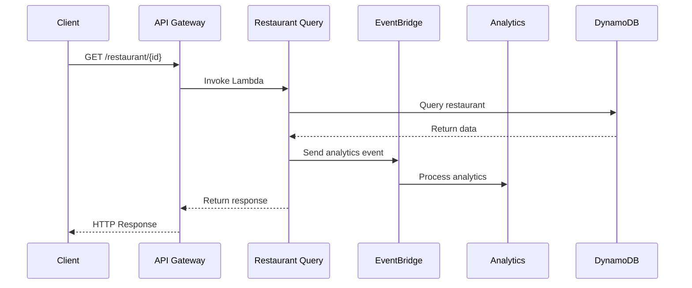
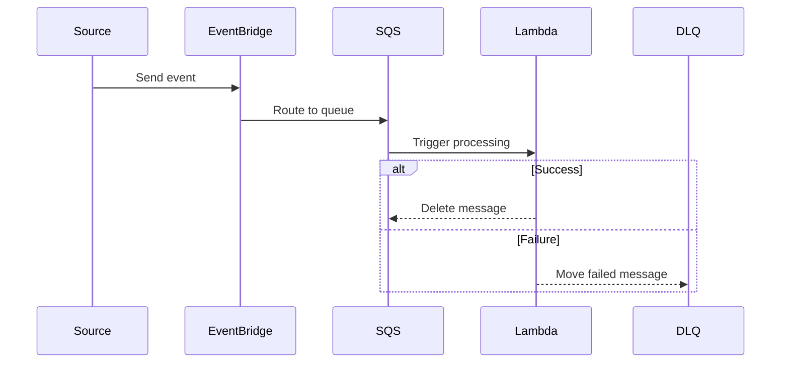

# Operational Workflows

Version: v1.0.0
Last Updated: 2024-12-09 11:16:36 +08:00
Status: Active

## Overview

Standard operating procedures for managing event flows in the Bellyfed platform.

## Event Processing Workflows

### 1. Restaurant Query Event Flow

### 2. Event Processing Flow

## Deployment Workflows

### 1. Event Bus Creation

1. Create EventBridge event bus
2. Configure IAM permissions
3. Set up event rules
4. Test event routing

### 2. Queue Configuration

1. Create SQS queue
2. Set up DLQ
3. Configure retry policy
4. Set visibility timeout
5. Enable encryption

## Monitoring Workflows

### 1. Performance Monitoring

1. Set up CloudWatch metrics
2. Configure alarms
3. Create dashboards
4. Enable logging

### 2. Error Handling

1. Monitor DLQ
2. Process failed messages
3. Update error patterns
4. Adjust retry policies

## Maintenance Workflows

### 1. Event Bus Maintenance

1. Review event patterns
2. Clean up unused rules
3. Update permissions
4. Optimize routing

### 2. Queue Maintenance

1. Check queue depth
2. Process DLQ messages
3. Update configurations
4. Optimize throughput
