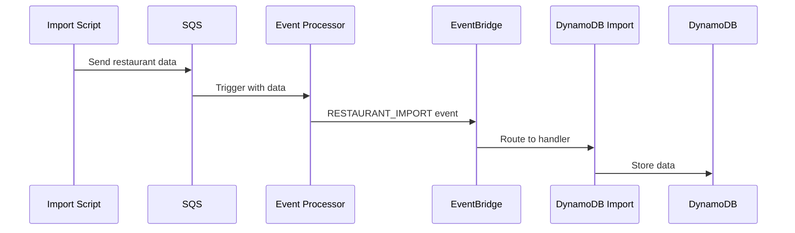
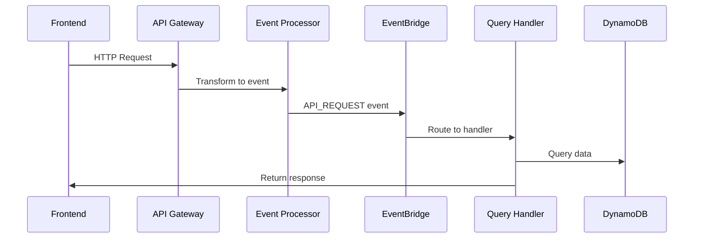
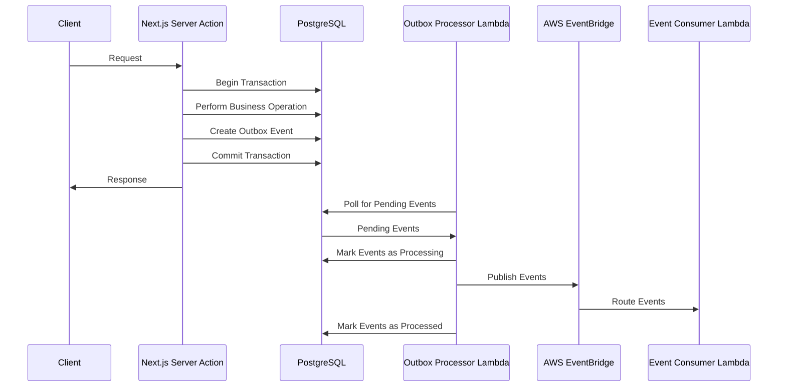

# BellyFed Event-Driven Architecture

**Document Type:** ARCH
**Last Updated:** December 2024
**Owner:** Backend Team
**Reviewers:** Architecture Team

## Overview

BellyFed uses an event-driven architecture to handle operations, including data imports and API requests. This document outlines the flow of data and events through the system, including the integration with Next.js 15 Server Actions through the outbox pattern.

## Components

### 1. API Gateway

- Serves as the entry point for frontend requests
- Transforms HTTP requests into standardized events
- Routes all requests to the Event Processor Lambda
- Endpoints:
    ```
    GET /restaurants
    GET /restaurants/{id}
    GET /restaurants/{id}/menu
    GET /restaurants/{id}/reviews
    ```

### 2. Event Processor Lambda

- Handles both SQS messages and API Gateway events
- Standardizes events into a common format
- Forwards events to EventBridge
- Event format:
    ```typescript
    {
        event_id: string;
        timestamp: string;
        event_type: string;
        source: string;
        version: string;
        trace_id: string;
        status: string;
        payload: any;
    }
    ```

### 3. EventBridge

- Central event bus for the application
- Routes events based on pattern matching rules
- Triggers appropriate Lambda functions based on event type

### 4. DynamoDB Tables

- FoodEstablishment Table:
    ```typescript
    {
      PK: `EST#${id}`,
      SK: `META#${id}`,
      GSI1PK: `LOC#${city}`,
      GSI1SK: `EST#${name}#${id}`,
      GSI2PK: `CUISINE#${cuisineType}`,
      GSI2SK: `EST#${name}#${id}`,
      // Other fields...
    }
    ```
- MenuItem Table
- Review Table
- Other related tables...

## Event Flow Examples

### 1. Restaurant Import Flow



_Figure 1: Restaurant import flow through SQS and EventBridge_

### 2. API Request Flow



_Figure 2: API request flow through API Gateway and EventBridge_

### 3. Server Actions with Outbox Pattern Flow



_Figure 3: Server Actions with outbox pattern flow_

## Event Types

### 1. Import Events

- `RESTAURANT_IMPORT`: New restaurant data import
- Source: 'import-processor'

### 2. API Events

- `GET_RESTAURANTS`: List restaurants (with optional filters)
- `GET_RESTAURANT`: Get specific restaurant details
- `GET_RESTAURANT_MENU`: Get restaurant menu items
- `GET_RESTAURANT_REVIEWS`: Get restaurant reviews
- Source: 'api-gateway'

### 3. Outbox Events

- `RESTAURANT_CREATED`: New restaurant created via Server Action
- `RESTAURANT_UPDATED`: Restaurant updated via Server Action
- `REVIEW_CREATED`: New review created via Server Action
- `IMPORT_JOB_CREATED`: New import job created via Server Action
- Source: 'outbox-processor'

## Frontend Integration

### REST API Integration

```typescript
const api = {
    baseUrl: 'YOUR_API_URL',
    headers: {
        'X-Api-Key': 'YOUR_API_KEY',
        'Content-Type': 'application/json',
    },

    async getRestaurants(params?: { city?: string; cuisine?: string }) {
        const queryString = params ? `?${new URLSearchParams(params)}` : '';
        const response = await fetch(`${this.baseUrl}/restaurants${queryString}`, {
            headers: this.headers,
        });
        return response.json();
    },

    async getRestaurant(id: string) {
        const response = await fetch(`${this.baseUrl}/restaurants/${id}`, {
            headers: this.headers,
        });
        return response.json();
    },
    // ... other methods
};
```

### Server Actions Integration

```typescript
'use client'

import { createRestaurant } from '@/app/actions/restaurants.js';
import { useState } from 'react';

export default function RestaurantForm() {
    const [name, setName] = useState('');
    const [address, setAddress] = useState('');
    const [error, setError] = useState<string | null>(null);
    const [success, setSuccess] = useState(false);

    async function handleSubmit(formData: FormData) {
        setError(null);
        setSuccess(false);

        const result = await createRestaurant(formData);

        if (result.error) {
            setError(result.error);
        } else {
            setSuccess(true);
            setName('');
            setAddress('');
        }
    }

    return (
        <form action={handleSubmit}>
            <div>
                <label htmlFor="name">Name</label>
                <input
                    id="name"
                    name="name"
                    value={name}
                    onChange={(e) => setName(e.target.value)}
                />
            </div>

            <div>
                <label htmlFor="address">Address</label>
                <input
                    id="address"
                    name="address"
                    value={address}
                    onChange={(e) => setAddress(e.target.value)}
                />
            </div>

            {error && <div className="error">{error}</div>}
            {success && <div className="success">Restaurant created successfully!</div>}

            <button type="submit">Create Restaurant</button>
        </form>
    );
}
```

## Security

- API Gateway requires API Key
- CORS enabled with specific origins
- WAF rules for rate limiting and security
- EventBridge rules enforce event validation
- DynamoDB uses fine-grained IAM permissions

## Deployment Stages

- Development (dev)
- QA
- Staging
- Production

Each stage has its own:

- API Gateway
- EventBridge bus
- DynamoDB tables
- Lambda functions

## Monitoring and Logging

- CloudWatch logs for all components
- API Gateway access logs
- Lambda execution logs
- EventBridge metrics
- DynamoDB metrics and alarms
- Outbox processor metrics and logs

## References

- [Outbox Pattern Implementation](./outbox-pattern.md)
- [Server Actions Guide](../../DEVELOPMENT/frontend/server-actions-guide.md)
- [Next.js 15 Migration](../next-server-actions-migration.md)
- [AWS EventBridge Documentation](https://docs.aws.amazon.com/eventbridge/latest/userguide/eb-what-is.html)
- [AWS Lambda Documentation](https://docs.aws.amazon.com/lambda/latest/dg/welcome.html)

---

**Labels:** architecture, event-driven, outbox-pattern, server-actions, eventbridge
