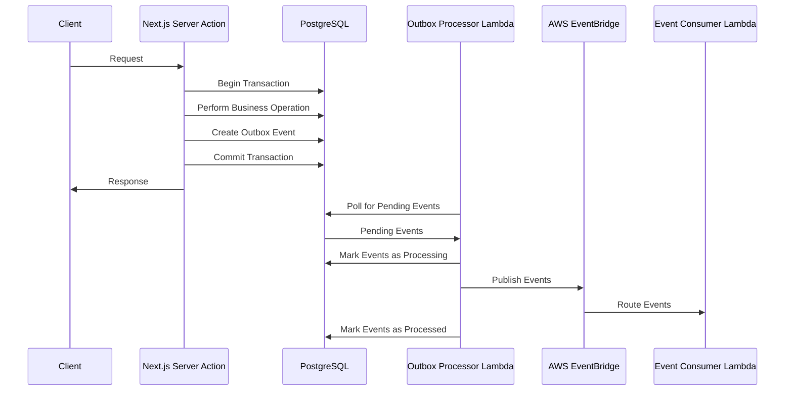

# Outbox Pattern Implementation

**Document Type:** ARCH
**Last Updated:** December 2024
**Owner:** Backend Team
**Reviewers:** Architecture Team

## Overview

This document describes the implementation of the outbox pattern in the Bellyfed application, which ensures reliable event delivery from Next.js Server Actions to AWS event-driven architecture.

## What is the Outbox Pattern?

The outbox pattern is a design pattern that ensures reliable event delivery in distributed systems. It works by:

1. Storing events in a database table (the "outbox") alongside business operations
2. Using a separate process to reliably deliver these events to external systems
3. Ensuring data consistency between database operations and event publishing

## Why Use the Outbox Pattern?

In the Bellyfed application, we use the outbox pattern to:

1. **Ensure Atomicity**: Database operations and event creation are performed in a single transaction
2. **Guarantee Delivery**: Events are reliably delivered even if the external system is temporarily unavailable
3. **Maintain Consistency**: Events are only published if the database transaction succeeds
4. **Support Idempotency**: Events can be safely retried without causing duplicate processing

## Architecture

The outbox pattern implementation in Bellyfed consists of the following components:



_Figure 1: Sequence diagram showing the outbox pattern flow from client request through event processing_

### Components

1. **Next.js Server Actions**: Perform business operations and create outbox events in a single transaction
2. **PostgreSQL Database**: Stores business data and outbox events
3. **Outbox Processor Lambda**: Polls the database for pending events and publishes them to EventBridge
4. **AWS EventBridge**: Routes events to appropriate consumers
5. **Event Consumer Lambdas**: Process events for specific use cases

## Implementation Details

### Database Schema

The outbox events are stored in the `outbox_events` table in the PostgreSQL database:

```prisma
// Outbox Event model for reliable event delivery
model OutboxEvent {
  id          String    @id @default(uuid())
  aggregateId String
  eventType   String
  payload     String    @db.Text
  status      String    @default("PENDING")
  processedAt DateTime? @map("processed_at")
  createdAt   DateTime  @default(now()) @map("created_at")
  updatedAt   DateTime  @updatedAt @map("updated_at")

  @@index([status, createdAt])
  @@index([aggregateId])
  @@index([eventType])
  @@index([processedAt])
  @@map("outbox_events")
}
```

### Outbox Library

The outbox pattern is implemented in the `packages/frontend/lib/outbox/index.ts` file:

```typescript
/**
 * Creates an outbox event for reliable event delivery
 *
 * @param type - Event type
 * @param payload - Event payload
 * @param aggregateId - ID of the aggregate entity (e.g., import job ID)
 * @returns The created outbox event
 */
export async function createOutboxEvent(type: string, payload: any, aggregateId: string) {
    return prisma.outboxEvent.create({
        data: {
            id: uuidv4(),
            aggregateId,
            eventType: type,
            payload: JSON.stringify(payload),
            status: OutboxEventStatus.PENDING,
            createdAt: new Date(),
        },
    });
}

/**
 * Creates an outbox event within a transaction
 *
 * @param tx - Prisma transaction
 * @param type - Event type
 * @param payload - Event payload
 * @param aggregateId - ID of the aggregate entity
 * @returns The created outbox event
 */
export async function createOutboxEventInTransaction(
    tx: PrismaClient,
    type: string,
    payload: any,
    aggregateId: string
) {
    return tx.outboxEvent.create({
        data: {
            id: uuidv4(),
            aggregateId,
            eventType: type,
            payload: JSON.stringify(payload),
            status: OutboxEventStatus.PENDING,
            createdAt: new Date(),
        },
    });
}
```

### Server Action Integration

Server Actions use the outbox pattern to ensure reliable event delivery:

```typescript
// Create import job with transaction to ensure atomicity with outbox event
const jobId = uuidv4();

const result = await prisma.$transaction(async (tx: any) => {
    // Create the import job
    const job = await tx.importJob.create({
        data: {
            id: jobId,
            sourceId,
            userId: session.user.id,
            jobType,
            status: 'PENDING',
            parameters: parameters || {},
            region,
            searchQuery,
        },
    });

    // Create outbox event
    await createOutboxEventInTransaction(
        tx,
        ImportEventType.IMPORT_JOB_CREATED,
        {
            jobId: job.id,
            sourceId: job.sourceId,
            userId: job.userId,
            jobType: job.jobType,
            parameters: job.parameters,
        },
        job.id
    );

    return job;
});
```

### Outbox Processor Lambda

The outbox processor Lambda function (`packages/infra/functions/outbox-processor/index.ts`) is responsible for:

1. Polling the database for pending outbox events
2. Publishing events to EventBridge
3. Marking events as processed

## Best Practices

1. **Use Transactions**: Always create outbox events within the same transaction as business operations
2. **Include Metadata**: Include relevant metadata in event payloads for tracing and debugging
3. **Implement Idempotency**: Ensure event consumers are idempotent to handle duplicate events
4. **Monitor Processing**: Set up monitoring and alerting for the outbox processor
5. **Clean Up Processed Events**: Implement a cleanup process for processed events

## Monitoring

The outbox pattern implementation is monitored through:

1. **CloudWatch Metrics**: Lambda invocations, event processing counts, etc.
2. **CloudWatch Logs**: Detailed logs from the outbox processor Lambda
3. **Database Queries**: Status of outbox events

## References

- [Outbox Pattern Documentation](https://microservices.io/patterns/data/transactional-outbox.html)
- [Prisma Documentation](https://www.prisma.io/docs)
- [AWS EventBridge Documentation](https://docs.aws.amazon.com/eventbridge/latest/userguide/eb-what-is.html)
- [Server Actions Guide](../../DEVELOPMENT/frontend/server-actions-guide.md)
- [Event-Driven Architecture](./event-flows.md)

---

**Labels:** architecture, outbox-pattern, event-driven, server-actions, reliability
