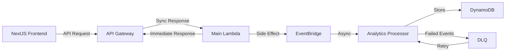

# Analytics Architecture

## Event Flow

### Event Sources

1. **API Gateway and Lambda Functions**

    - Synchronous API responses for user requests
    - Side-effect analytics event emission
    - Non-blocking analytics processing
    - Built-in error handling and retries

2. **DynamoDB**

    - Read/write capacity usage
    - Hot partition detection
    - Throttling events

3. **User Interactions**
    - Restaurant views (via API Gateway)
    - Menu item views (via API Gateway)
    - Review submissions (via API Gateway)
    - Search patterns (via API Gateway)

## Event Types

### Restaurant Events

1. `RESTAURANTS_LISTED`

```typescript
{
  event_id: string;
  timestamp: string;
  filters: {
    city?: string;
    cuisine?: string;
  };
  results_count: number;
}
```

2. `RESTAURANT_VIEWED`

```typescript
{
    event_id: string;
    timestamp: string;
    restaurant_id: string;
    source: 'search' | 'direct' | 'recommendation';
}
```

3. `RESTAURANT_MENU_VIEWED`

```typescript
{
    event_id: string;
    timestamp: string;
    restaurant_id: string;
    items_count: number;
}
```

4. `RESTAURANT_REVIEWS_VIEWED`

```typescript
{
    event_id: string;
    timestamp: string;
    restaurant_id: string;
    reviews_count: number;
}
```

## Event Processing Flow



### Key Components

1. **API Gateway and Lambda**

    - Synchronous request handling
    - Immediate response to frontend
    - Side-effect analytics generation
    - Non-blocking event emission

2. **EventBridge**

    - Asynchronous event routing
    - Event pattern matching
    - Delivery guarantees
    - Multi-account support

3. **Analytics Processor**

    - Event validation and enrichment
    - DynamoDB persistence
    - Error handling with DLQ
    - TTL management

4. **Dead Letter Queue (DLQ)**
    - Failed event capture
    - Retry mechanism
    - Event preservation
    - Debugging support

## Monitoring and Alerting

### CloudWatch Metrics

1. **API Gateway**

    - Request count by endpoint
    - Response latency
    - 4xx and 5xx error rates

2. **Lambda**

    - Invocation count
    - Duration
    - Error count and types
    - Memory usage

3. **DynamoDB**

    - Consumed read/write capacity
    - Throttled requests
    - Scan/query success rate

4. **EventBridge**
    - Event delivery success rate
    - Event processing latency
    - Failed event count

### Alerts

1. **Critical Alerts**

    - API Gateway 5xx errors > 1%
    - Lambda errors > 5%
    - DynamoDB throttling > 10%
    - Event processing delays > 5 minutes

2. **Warning Alerts**
    - API Gateway 4xx errors > 5%
    - Lambda duration > 5 seconds
    - DynamoDB capacity > 80%
    - Failed event count > 100/hour

## Data Retention

1. **Raw Events**

    - Store in S3 for 90 days
    - Partitioned by date for efficient querying

2. **Aggregated Metrics**

    - Store in TimeStream for 1 year
    - 1-minute resolution for first 7 days
    - 1-hour resolution for remaining data

3. **Business Intelligence**
    - Export daily summaries to Redshift
    - Retain indefinitely for trend analysis
