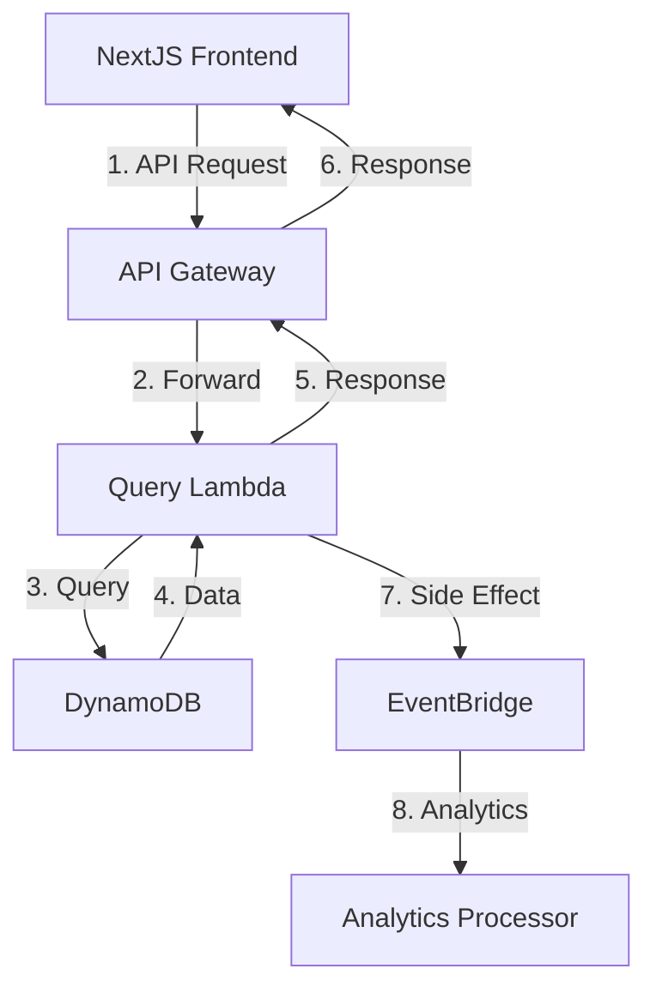
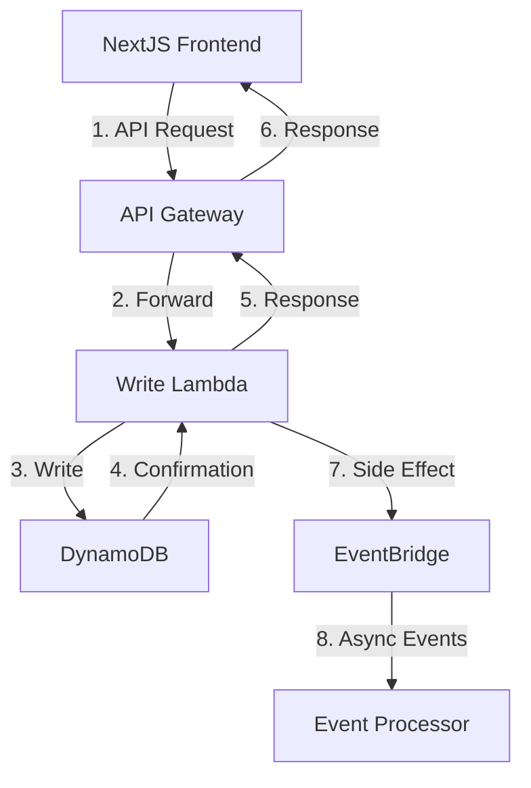
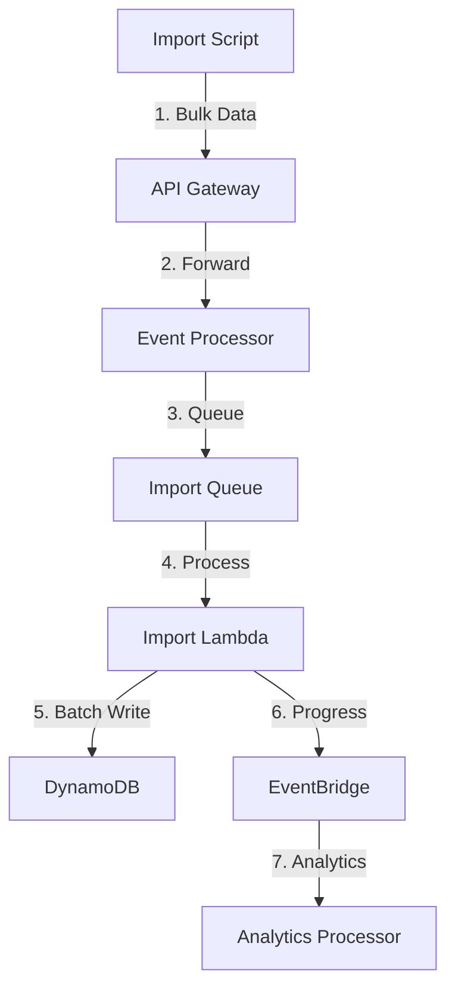
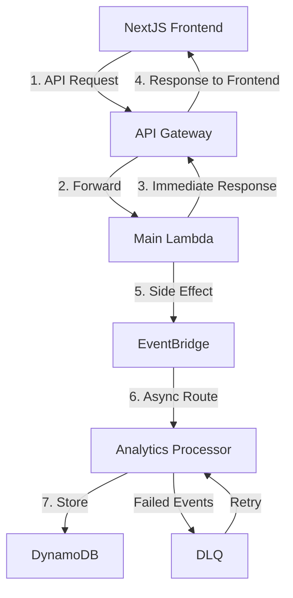

# Event Processing Flows

## Overview

This document describes the high-level event flows in our system, focusing on how different types of events are processed and routed through our infrastructure.

## Key Concepts

### Event Types

1. **Query Events**

    - Read-only operations
    - Direct database queries
    - Real-time responses
    - Automatic analytics tracking

2. **Write Events**

    - Data modifications
    - Transactional operations
    - Analytics tracking
    - Performance monitoring

3. **Import Events**

    - Batch operations
    - Large data sets
    - Progress tracking
    - Resource usage analytics

4. **Analytics Events**
    - Automatic generation for all operations
    - Performance metrics
    - Error tracking
    - User behavior analysis

### Processing Components

- Event Processor: Central routing and analytics generation
- SQS Queues: Event buffering
- Lambda Functions: Event handling
- EventBridge: Event distribution
- DynamoDB: Data storage
- Analytics EventBus: Dedicated analytics pipeline

## Flow Diagrams

### Query Flow



### Query Flow Details

1. **Synchronous Path**

    - Frontend makes API request through API Gateway
    - Request routed directly to Query Lambda
    - Lambda queries DynamoDB
    - Immediate response returned to user
    - No event processor involvement in main flow

2. **Side Effects**
    - Analytics events generated after response
    - Events sent to EventBridge
    - Asynchronous processing by Analytics Processor
    - No impact on query response time

### Write Flow



### Import Flow



## Analytics Architecture

### Analytics Event Structure

```typescript
interface AnalyticsEvent {
    eventType: string; // Original event type with _ANALYTICS suffix
    source: string; // Event origin
    requestId: string; // AWS request ID
    detail: {
        action: string; // Event action (EXECUTE, WRITE, etc.)
        type: string; // Original event type
        timestamp: string; // ISO timestamp
        userId?: string; // User identifier
        metadata: {
            source: string; // Source system
            traceId?: string; // Trace ID for request tracking
            duration?: number; // Processing duration in ms
            status: string; // SUCCESS or FAILURE
            errorType?: string; // Error classification if failed
            eventCategory: string; // USER_ACTION, SYSTEM_EVENT, etc.
            properties: {
                // Additional context
                functionName: string;
                functionVersion: string;
                memoryLimitInMB: number;
                remainingTime: number;
                // Event-specific data
            };
        };
    };
}
```

### Analytics Flow



### Analytics Flow Details

1. **Request Handling**

    - Frontend makes API request through API Gateway
    - Lambda processes request and returns immediate response
    - Analytics events generated as side effects
    - Non-blocking event emission after response

2. **Event Routing**

    - Analytics events sent to EventBridge after response
    - Pattern-based routing to Analytics Processor
    - Guaranteed delivery with retry mechanism
    - Multi-account support for cross-account analytics

3. **Event Processing**

    - Analytics Processor validates and enriches events
    - Events stored in DynamoDB with TTL
    - Failed events captured in DLQ
    - Automatic retry mechanism for failed events

4. **Error Handling**
    - Main API responses not affected by analytics errors
    - DLQ captures failed processing attempts
    - Automatic retries with backoff
    - Alert generation for repeated failures

### Key Benefits

1. **Performance**

    - Immediate API responses for user actions
    - Non-blocking analytics processing
    - Efficient resource utilization
    - Scalable event processing

2. **Reliability**

    - Guaranteed API responses
    - Separate analytics error handling
    - No impact on main user flow
    - Event preservation in DLQ

3. **Maintainability**

    - Clear separation of concerns
    - Side-effect based analytics
    - Centralized processing
    - Independent scaling

4. **User Experience**
    - Fast API responses
    - No delays from analytics
    - Reliable core functionality
    - Transparent analytics collection

### Analytics Categories

1. **User Actions**

    - User-initiated events
    - UI interactions
    - Profile updates
    - Preference changes

2. **System Events**

    - Background operations
    - Maintenance tasks
    - Resource management
    - Health checks

3. **Authentication Events**

    - Login attempts
    - Signup events
    - Password changes
    - Session management

4. **Query Events**
    - Search operations
    - Data retrieval
    - Filter applications
    - Sort operations

### Analytics Capabilities

1. **Performance Monitoring**

    - Event duration tracking
    - Memory usage analysis
    - Function execution metrics
    - Resource utilization

2. **Error Tracking**

    - Error classification
    - Failure rates
    - Error patterns
    - Recovery metrics

3. **User Behavior Analysis**

    - User journey tracking
    - Feature usage patterns
    - Session analysis
    - Conversion tracking

4. **System Health**
    - Resource consumption
    - Event throughput
    - Processing latency
    - Error rates

## Common Scenarios

### 1. User Queries Data

1. User sends query through API
2. Request routed directly to Query Lambda
3. Lambda queries DynamoDB
4. Results returned to user
5. Analytics event recorded

### 2. System Updates Data

1. System initiates write operation
2. Request routed directly to Write Lambda
3. Lambda performs DynamoDB update
4. Operation status tracked
5. Analytics event recorded

### 3. Bulk Data Import

1. Admin initiates import
2. Event Processor routes to Import Queue
3. Import Lambda handles batches
4. Progress tracked through analytics
5. Failed items sent to DLQ

## Best Practices

### Event Processing

1. Keep events small and focused
2. Include necessary context
3. Use appropriate event type
4. Handle failures gracefully

### Queue Management

1. Monitor queue depths
2. Set appropriate timeouts
3. Use DLQs for failures
4. Implement retry logic

### Analytics

1. Track all operations
2. Monitor performance
3. Record error rates
4. Analyze patterns

### Event Categorization

1. Use consistent event naming
2. Apply appropriate categories
3. Include relevant metadata
4. Maintain traceability

### Error Handling

1. Capture error details
2. Include stack traces
3. Track error frequency
4. Monitor recovery patterns

### Performance Optimization

1. Monitor event duration
2. Track resource usage
3. Identify bottlenecks
4. Optimize based on metrics

### Data Privacy

1. Sanitize sensitive data
2. Follow data retention policies
3. Implement access controls
4. Maintain compliance

## Related Documents

- [Event Processing Guide](../engineering/event-processing/overview.md)
- [Event Bus Architecture](event-bus-architecture.md)
- [API Documentation](../engineering/api/api-overview.md)
