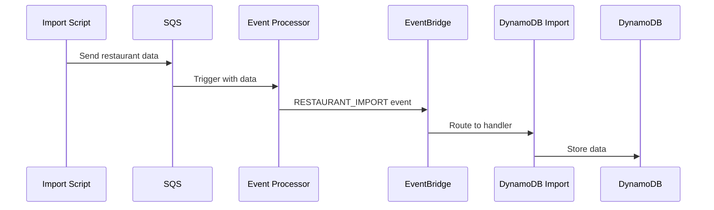
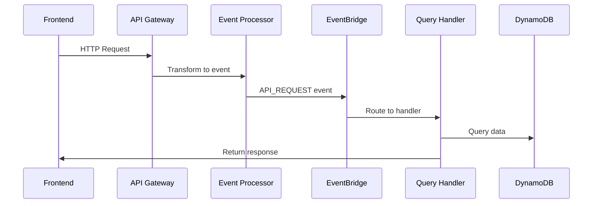

# BellyFed Event-Driven Architecture Documentation

## Overview

BellyFed uses an event-driven architecture to handle all operations, including data imports and API requests. This document outlines the flow of data and events through the system.

## Components

### 1. API Gateway

- Serves as the entry point for frontend requests
- Transforms HTTP requests into standardized events
- Routes all requests to the Event Processor Lambda
- Endpoints:
    ```
    GET /restaurants
    GET /restaurants/{id}
    GET /restaurants/{id}/menu
    GET /restaurants/{id}/reviews
    ```

### 2. Event Processor Lambda

- Handles both SQS messages and API Gateway events
- Standardizes events into a common format
- Forwards events to EventBridge
- Event format:
    ```typescript
    {
        event_id: string;
        timestamp: string;
        event_type: string;
        source: string;
        version: string;
        trace_id: string;
        status: string;
        payload: any;
    }
    ```

### 3. EventBridge

- Central event bus for the application
- Routes events based on pattern matching rules
- Triggers appropriate Lambda functions based on event type

### 4. DynamoDB Tables

- FoodEstablishment Table:
    ```typescript
    {
      PK: `EST#${id}`,
      SK: `META#${id}`,
      GSI1PK: `LOC#${city}`,
      GSI1SK: `EST#${name}#${id}`,
      GSI2PK: `CUISINE#${cuisineType}`,
      GSI2SK: `EST#${name}#${id}`,
      // Other fields...
    }
    ```
- MenuItem Table
- Review Table
- Other related tables...

## Event Flow Examples

### 1. Restaurant Import Flow



### 2. API Request Flow



## Event Types

### 1. Import Events

- `RESTAURANT_IMPORT`: New restaurant data import
- Source: 'import-processor'

### 2. API Events

- `GET_RESTAURANTS`: List restaurants (with optional filters)
- `GET_RESTAURANT`: Get specific restaurant details
- `GET_RESTAURANT_MENU`: Get restaurant menu items
- `GET_RESTAURANT_REVIEWS`: Get restaurant reviews
- Source: 'api-gateway'

## Frontend Integration

```typescript
const api = {
    baseUrl: 'YOUR_API_URL',
    headers: {
        'X-Api-Key': 'YOUR_API_KEY',
        'Content-Type': 'application/json',
    },

    async getRestaurants(params?: { city?: string; cuisine?: string }) {
        const queryString = params ? `?${new URLSearchParams(params)}` : '';
        const response = await fetch(`${this.baseUrl}/restaurants${queryString}`, {
            headers: this.headers,
        });
        return response.json();
    },

    async getRestaurant(id: string) {
        const response = await fetch(`${this.baseUrl}/restaurants/${id}`, {
            headers: this.headers,
        });
        return response.json();
    },
    // ... other methods
};
```

## Security

- API Gateway requires API Key
- CORS enabled with specific origins
- WAF rules for rate limiting and security
- EventBridge rules enforce event validation
- DynamoDB uses fine-grained IAM permissions

## Deployment Stages

- Development (dev)
- QA
- Staging
- Production

Each stage has its own:

- API Gateway
- EventBridge bus
- DynamoDB tables
- Lambda functions

## Monitoring and Logging

- CloudWatch logs for all components
- API Gateway access logs
- Lambda execution logs
- EventBridge metrics
- DynamoDB metrics and alarms
