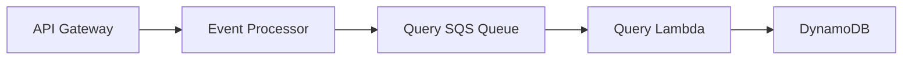
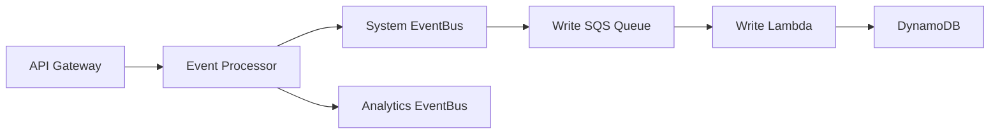
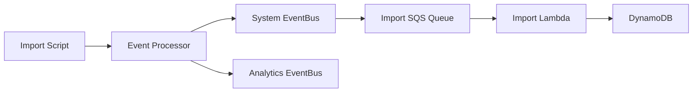

# Event Processing System

## Technical Overview

The Event Processing System is a distributed architecture that handles various types of events through different processing flows. It uses AWS services including Lambda, SQS, EventBridge, and DynamoDB to ensure reliable and scalable event processing.

## Architecture Components

### Event Processor Lambda

- **Purpose**: Central event router that receives events from API Gateway
- **Flows**:
    - Query Flow: Routes query requests to Query SQS Queue
    - Write Flow: Routes write operations to System EventBus
    - Import Flow: Routes import operations to System EventBus
- **Analytics**: Sends analytics events for all operations

### Query Processor Lambda

- **Purpose**: Handles all DynamoDB read operations
- **Operations**:
    - Get: Retrieve single items by key
    - Query: Execute index-based queries
    - Scan: Perform full table scans
- **Input**: Receives messages from Query SQS Queue
- **Memory**: 256MB
- **Timeout**: 30 seconds

### Write Processor Lambda

- **Purpose**: Handles individual DynamoDB write operations
- **Operations**:
    - Write: Insert new items
    - Update: Modify existing items
    - Delete: Remove items
- **Input**: Receives messages from Write SQS Queue
- **Memory**: 256MB
- **Timeout**: 30 seconds

### Import Processor Lambda

- **Purpose**: Handles batch import operations
- **Features**:
    - Batch processing (25 items per batch)
    - Unprocessed items handling
    - Retry logic
- **Input**: Receives messages from Import SQS Queue
- **Memory**: 512MB
- **Timeout**: 5 minutes

### Analytics Processor Lambda

- **Purpose**: Processes analytics events
- **Input**: Receives messages from Analytics SQS Queue
- **Operations**: Tracks API usage and import operations

## Event Flows

### 1. Query Flow

### 2. Write Flow

### 3. Import Flow

## Configuration

### Environment Variables

#### Event Processor

- `USER_EVENT_BUS`: User domain event bus name
- `AUTH_EVENT_BUS`: Auth domain event bus name
- `SYSTEM_EVENT_BUS`: System infrastructure event bus name
- `ANALYTICS_EVENT_BUS`: Analytics event bus name
- `QUERY_QUEUE_URL`: URL for the query SQS queue

### Dead Letter Queues

- Write DLQ: Handles failed write operations
- Import DLQ: Handles failed import operations

## Error Handling

### Common Issues

1. **Query Flow Issues**

    - Check Query SQS Queue
    - Monitor Lambda timeouts
    - Review DynamoDB throttling

2. **Write Flow Issues**

    - Check Write SQS Queue
    - Review Write DLQ
    - Monitor EventBridge delivery

3. **Import Flow Issues**
    - Check Import SQS Queue
    - Review Import DLQ
    - Monitor batch processing errors
