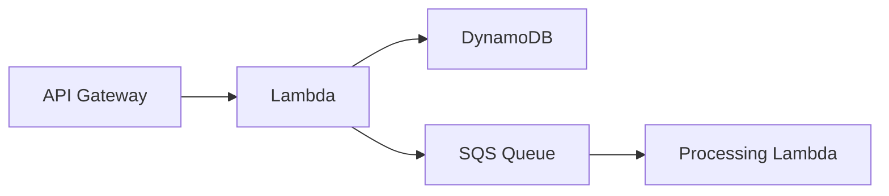

# Bellyfed Documentation Standards Guide

**Document Type:** STANDARD
**Last Updated:** December 2024
**Owner:** Documentation Team
**Reviewers:** Architecture Team

## Overview

This guide outlines the documentation standards for the Bellyfed platform. Our documentation follows a purpose-driven structure designed to support both human developers and AI agents in understanding and maintaining the codebase, while ensuring compatibility with Confluence for automated migration.

## Documentation Types

Our documentation is organized into several types, each with a specific purpose and target audience.

### 1. Technical Documentation (TECH)

**Target Audience:** Developers, AI Agents, Technical Staff
**Purpose:** Enable quick understanding and modification of technical systems
**Content Structure:**

- System Architecture
    - Component diagrams with clear interfaces
    - Data flow representations
    - State management patterns
    - Event-driven architectures
- API Documentation
    - OpenAPI/Swagger specifications
    - Type definitions
    - Example requests/responses
- Infrastructure as Code
    - Stack definitions
    - Resource relationships
    - Configuration patterns
- Security Implementation
    - Authentication flows
    - Authorization patterns
    - Compliance implementations

### 2. Operations Documentation (OPS)

**Target Audience:** Operations Teams, Support Staff, AI Agents
**Purpose:** Enable efficient system operations and incident response
**Content Structure:**

- Monitoring & Alerting
    - Metric definitions
    - Alert thresholds
    - Response procedures
- Troubleshooting Guides
    - Common failure patterns
    - Resolution steps
    - Recovery procedures
- Maintenance Procedures
    - Scaling operations
    - Backup procedures
    - Update processes

### 3. Development Standards (DEV)

**Target Audience:** Developers, AI Agents
**Purpose:** Maintain code quality and consistency
**Content Structure:**

- Code Organization
    - Project structure
    - Naming conventions
    - File organization
- Testing Standards
    - Test patterns
    - Coverage requirements
    - Integration testing
- CI/CD Practices
    - Pipeline definitions
    - Deployment strategies
    - Environment management

## Documentation Standards

### File Organization

- Place documentation close to relevant code
- Use clear, descriptive filenames
- Follow the format: `[Type]-[Component]-[Purpose].md`
- Examples:
    - `TECH-auth-flow.md`
    - `OPS-scaling-procedure.md`
    - `DEV-testing-standards.md`

### Document Structure

Each document should follow a consistent structure to ensure readability and compatibility with Confluence.

#### 1. Header Section

Every document should include a metadata header at the top:

```markdown
# [Title]

**Document Type:** [ARCH|CORE|DEV|FEAT|OPS|PROD]
**Last Updated:** [Date in MMMM YYYY format]
**Owner:** [Team/Individual]
**Reviewers:** [List of reviewers]
```

#### 2. Overview Section

The overview section should provide a brief introduction to the document:

- Purpose and scope of the document
- System context and relevance
- Prerequisites for understanding
- Related components or systems

#### 3. Main Content

The main content should be organized into clear, logical sections:

- Use proper heading levels (H2, H3, H4) to create a hierarchy
- Include code examples when relevant
- Add diagrams for complex flows
- Provide configuration examples
- Use tables for structured data
- Include admonitions (notes, warnings, tips) where appropriate

#### 4. References

The references section should include links to related resources:

- Related documents within the repository
- External resources and documentation
- API references
- Standards and specifications

#### 5. Labels

Add labels at the bottom of each document for Confluence categorization:

```markdown
---

**Labels:** label1, label2, label3
```

### Content Guidelines

#### For Human Readers

- Use clear, concise language
- Provide context and explanations
- Include visual aids
- Link to related resources

#### For AI Agents

- Include type definitions
- Specify interfaces clearly
- Document state transitions
- Provide example patterns

### Code Examples

- Use TypeScript/JavaScript for code examples
- Include type definitions
- Show error handling patterns
- Demonstrate best practices

```typescript
interface Config {
    region: string;
    stage: string;
    resources: {
        queue: string;
        table: string;
    };
}

// Example configuration
const config: Config = {
    region: 'us-west-2',
    stage: 'prod',
    resources: {
        queue: '${stage}-processing-queue',
        table: '${stage}-data-table',
    },
};
```

### Diagrams

Diagrams are essential for visualizing complex systems and workflows. For Confluence compatibility:

- Use Mermaid.js for diagrams (Confluence supports Mermaid diagrams)
- Include both visual representation and text description
- Document component relationships clearly
- Show data flows with directional arrows
- Add a descriptive caption below each diagram



_Figure 1: API request flow through serverless components_

For complex diagrams, consider breaking them down into smaller, focused diagrams that each illustrate a specific aspect of the system.

> **Note:** When migrating to Confluence, ensure that the Mermaid diagram macro is enabled in your Confluence instance.

## Maintenance

### Review Process

- Quarterly content reviews
- Technical accuracy validation
- Update on system changes
- Version control alignment

### Quality Checks

- Documentation linting
- Link validation
- Code example testing
- Type definition verification

## Implementation

### For New Components

1. Create technical design doc
2. Add implementation details
3. Include operational procedures
4. Document testing approach

### For Updates

1. Review existing docs
2. Update affected sections
3. Validate changes
4. Update last modified date

## Confluence Migration

### Formatting for Confluence

When writing documentation that will be migrated to Confluence, follow these additional guidelines:

1. **Use Proper Heading Levels**: Confluence uses heading levels to create the page hierarchy
2. **Tables**: Use standard Markdown tables for structured data
3. **Code Blocks**: Specify the language for syntax highlighting
4. **Admonitions**: Use the note, warning, and info formats that Confluence supports
5. **Images**: Include alt text and captions for all images
6. **Links**: Use relative links to other documents in the repository
7. **Labels**: Add labels at the bottom of each document for categorization

### Confluence Macros

Confluence supports several macros that can be represented in Markdown:

#### Info Panel

```markdown
> **Info**
> This is an information panel.
```

#### Warning Panel

```markdown
> **Warning**
> This is a warning panel.
```

#### Code Panel

````markdown
```typescript title="Example Code"
// This will be rendered as a code panel with a title
function example() {
    return 'Hello World';
}
```
````

### Confluence Space Mapping

Our documentation structure maps to Confluence spaces as follows:

| Documentation Directory | Confluence Space | Space Key |
| ----------------------- | ---------------- | --------- |
| ARCHITECTURE            | Architecture     | ARCH      |
| CORE                    | Core Platform    | CORE      |
| DEVELOPMENT             | Development      | DEV       |
| FEATURES                | Features         | FEAT      |
| OPERATIONS              | Operations       | OPS       |
| PROD                    | Product          | PROD      |

For more details on Confluence migration, see the [Confluence Migration Guide](../CONFLUENCE_MIGRATION_GUIDE.md) and [Confluence Formatting Guide](../confluence-formatting-guide.md).

---

This guide serves as the foundation for maintaining clear, consistent, and useful documentation for both human developers and AI agents. Follow these standards to ensure documentation remains a valuable resource for the project and migrates smoothly to Confluence.

---

**Labels:** documentation, standards, confluence, formatting
